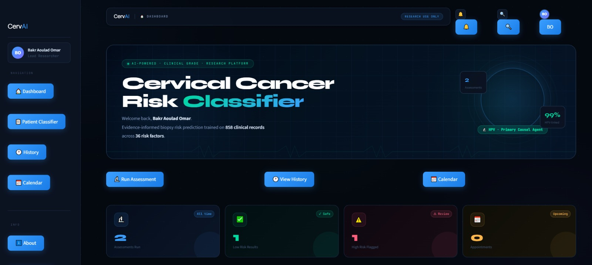
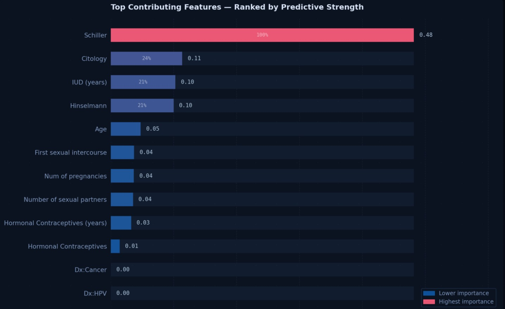

# 🎗️ Cervical Cancer Risk Classification

An end-to-end Machine Learning project for analyzing risk factors and predicting the likelihood of cervical cancer. The project covers exploratory data analysis (EDA), data preprocessing, model training, evaluation, and a deployable web application.

---

## 👨‍🏫 How to Run the Project

Follow these steps to reproduce the environment, train the models, and launch the application.

### 1. Setup the Environment

Clone or download the repository, then open a terminal at the root of the project (`Coding-week/`).

```bash
# Create and activate a virtual environment
python -m venv .venv

# On Windows:
.venv\Scripts\activate
# On macOS/Linux:
source .venv/bin/activate

# Install all required dependencies
pip install -r requirements.txt

```

### 2. Train and Evaluate Models

To verify the machine learning pipeline, run the evaluation script. This script will automatically train all 4 models (CatBoost, XGBoost, SVM, Random Forest), save the serialized `.joblib` files to the `models/` directory, and output a performance comparison table in the console.

```bash
# Run from the root directory
python src/evaluate_model.py

```

*Expected output: Training logs followed by a terminal table comparing Accuracy, Precision, Recall, F1, and ROC-AUC for all models.*

### 3. Launch the Web Application (Streamlit)

Once the models are generated in the `models/` folder, you can launch the interactive clinical risk platform.

```bash
streamlit run app/app.py

```

*Expected output: Your browser will automatically open `http://localhost:8501` displaying the CervAI application.*



### 4. Run Unit Tests

To verify code reliability and model constraints, run the pytest suite.

```bash
pytest tests/

```


## 📂 Project Structure

```text
Coding-week/
├── app/                  # Web application (app.py)
├── data/                 # Dataset (the original and the cleaned one)
├── models/               # Serialized trained models & assets (.joblib)
├── notebook/             
│   └── eda.ipynb         # Jupyter notebooks answering data processing questions
├── src/
│   ├── data_processing.py # Data cleaning and preparation
│   ├── train_model.py     # Model training functions
│   └── evaluate_model.py  # Model evaluation and execution pipeline
├── tests/                 # Unit tests for model reliability
├── Dockerfile             # Docker configuration for containerization
├── conftest.py            # Pytest configuration
├── requirements.txt       # Python dependencies
└── README.md

```

---

## 📊 Dataset & Methodology Responses

The dataset used is `risk_factors_cervical_cancer_original.csv`, stored in the `data/` directory.

### ❓ Q1 — Was the dataset balanced? If not, how did you handle imbalance? What was the impact?

**No, the dataset was severely imbalanced.**

* Class 0 (No risk): 803 patients — 93.6%
* Class 1 (At risk): 55 patients — 6.4%
* Imbalance ratio: 14.6 : 1

**Strategy chosen:** Manual oversampling on `X_train` only. Random duplication of minority class samples (with replacement, `np.random.seed(42)`) until both classes reached a 1:1 ratio. Oversampling was applied exclusively on the training set — the test set was kept untouched to reflect real-world distribution and avoid data leakage.

**Impact:** The model is no longer biased toward always predicting "No risk." The primary evaluation metric shifted from accuracy to Recall (Sensitivity), since false negatives (missing a cancer case) are clinically far more dangerous than false positives.

### ❓ Q2 — Which ML model performed best? Provide performance metrics.

**XGBoost was the best overall model**, achieving the highest balance between precision and recall, making it the most clinically reliable choice.

| Model | Accuracy | Precision | Recall | F1 | ROC-AUC |
| --- | --- | --- | --- | --- | --- |
| SVM | 0.9341 | 0.4000 | 0.4000 | 0.4000 | 0.9488 |
| **XGBoost** | **0.9670** | **0.6250** | **1.0000** | **0.7692** | **0.9674** |
| CatBoost | 0.9231 | 0.3333 | 0.4000 | 0.3636 | 0.9581 |
| Random Forest | 0.9231 | 0.3333 | 0.4000 | 0.3636 | 0.9558 |

## 📊 Model Performance Comaprison 


##  🔢 Confusion Matrices


**Why XGBoost?**
Given the medical context, **Recall is the most critical metric**. XGBoost achieved a perfect recall of **100%**, correctly identifying every at-risk patient in the test set. It also led in accuracy (96.7%), F1-score (76.9%), and ROC-AUC (0.9674).

### ❓ Q3 — Which medical features most influenced predictions (SHAP results)?

The SHAP analysis on our final model identified the following **Top Contributing Features**, ranked by their predictive strength:

| Rank | Feature | Importance Score | Relative Weight |
| :--- | :--- | :--- | :--- |
| 1 | **Schiller** | 0.48 | 100% |
| 2 | Citology | 0.11 | 24% |
| 3 | IUD (years) | 0.10 | 21% |
| 4 | Hinselmann | 0.10 | 24% |
| 5 | Age | 0.05 | 11% |
| 6 | First sexual intercourse | 0.04 | 9% |
| 7 | Num of pregnancies | 0.04 | 9% |
| 8 | Number of sexual partners | 0.03 | 7% |
| 9 | Hormonal Contraceptives (years) | 0.03 | 7% |
| 10 | Hormonal Contraceptives | 0.01 | 2% |

## 🎨  Shap Result 


### 💡 Key Insights from SHAP Analysis

* **Clinical Dominance:** The model correctly prioritizes objective medical tests. **Schiller** is the most powerful predictor by a massive margin, followed immediately by **Hinselmann** and **Citology**. This proves the model is learning clinical patterns rather than relying solely on demographic correlations.
* **The "Schiller Gap":** With an importance score of **0.46** (100% relative weight), the Schiller test is nearly **4x more influential** than the second-ranked feature. This highlights its status as the primary "red flag" in the UCI dataset.
* **Lifestyle Impact:** Among non-clinical factors, **IUD duration (years)** and **Age** are the most significant. This confirms that long-term physical interventions and biological aging are measurable secondary risk factors for cervical dysplasia.
* **Behavioral Co-factors:** Sexual history (first intercourse, number of partners) and hormonal contraceptive use have a visible but **minor impact** (under 10% weight) compared to clinical screening results. This suggests that while lifestyle contributes to risk, the diagnostic tests are the ultimate deciders for the model.

### ❓ Q4 — What insights did prompt engineering provide for your selected task?

Prompt engineering was used as a development assistant across three key areas of the project. The examples below are real prompts used during development.

---

#### 1. 🤖 Model Selection & Training

**Prompt used:**
> *"I have a binary classification dataset with 858 patients, 55 positives (6.4%) and 803 negatives (93.6%). I already did a stratified train/test split. Which ML algorithm would you recommend between XGBoost, CatBoost, SVM and Random Forest for this kind of severe imbalance in a medical context where missing a positive case is critical?"*

**Insight gained:** The LLM explained that **Recall should be the primary metric** rather than accuracy, and recommended XGBoost and CatBoost as first choices because gradient boosting handles imbalanced data better than SVM or Random Forest at this sample size. It also suggested setting `scale_pos_weight` in XGBoost as an alternative to manual oversampling. Providing the exact numbers (858, 55, 6.4%) produced a far more targeted answer than asking generically *"which model for imbalanced data"*.

---

#### 2. 🧹 Data Cleaning & Preprocessing

**Prompt used:**
> *"My CSV file encodes missing values as the string '?' instead of NaN. pandas reads them as object columns. How do I fix this while keeping numeric types and avoiding converting valid zeros to NaN?"*

**Insight gained:** The LLM provided the exact two-line fix:
```python
df = df.replace('?', np.nan).apply(pd.to_numeric, errors='coerce')
```
It also explained why `errors='coerce'` is the right choice here — it turns only non-convertible strings into NaN while leaving valid numbers (including 0) untouched.

**Second prompt used:**
> *"Should I use mean or median imputation for this dataset? It has outliers in columns like Age (max 84), Number of sexual partners (max 28), Smokes (years) (max 37). I already removed IQR outliers but some extreme values remain."*

**Insight gained:** The LLM recommended **median imputation** because the remaining skewed distributions make the mean unrepresentative — a single patient with 28 partners would inflate the imputed mean for everyone. It also warned not to `fit_transform` the imputer on `X_test`, only `transform`, to prevent data leakage — a subtle bug that would have inflated our test metrics.

---

#### 3. 📊 SHAP & Streamlit Implementation

**Prompt used:**
> *"I'm getting this error in Streamlit when rendering an SVG chart inside st.markdown(): the SVG shows in the HTML source but nothing displays on screen. Here is my code: [code snippet]. How do I fix this?"*

**Insight gained:** The LLM diagnosed the root cause immediately — Streamlit sanitizes HTML injected via `st.markdown()` and strips `<svg>` tags entirely for security reasons. It proposed two alternatives: `st.components.v1.html()` for a full iframe, or `st.pyplot()` with matplotlib which is natively supported. This saved hours of debugging.

**Third prompt used:**
> *"I have a CatBoost model with `get_feature_importance()`. I want a horizontal bar chart showing the top 12 features, with bars colored by a gradient from teal (low importance) to red (high importance), on a dark background matching this CSS color scheme: bg=#0b1220, text=#d8e4f5. Use matplotlib."*

**Insight gained:** Providing the exact color hex codes and background from the existing CSS directly in the prompt produced chart code that matched the app theme without any visual adjustment needed. Vague prompts like *"make it dark themed"* required 3–4 iteration rounds to reach the same result.

---

#### 💡 General Insight

The most effective prompts shared three properties: they included **exact numbers** (858 rows, 55 positives), **exact error messages** (copied from the terminal), and **exact constraints** (already split, can't re-fit on test). Vague prompts like *"how to handle imbalanced data"* returned generic textbook answers. Specific prompts returned code that ran on the first try.

---

## 👥 Contributors

* [@yahya-dev-e (Yahya El Omari)](https://github.com/yahya-dev-e)
* [@yassirjbili (Yassir Jbili)](https://github.com/yassirjbili)
* [@bakraouladomar (Bakr Aoulad Omar)](https://github.com/bakraouladomar)
* [@elhaddadmohamed021-prog (Mohamed El Haddad)](https://github.com/elhaddadmohamed021-prog)
* [@random255555 (Ilyass El Hadad)](https://github.com/random255555)

---

## 📄 License

This project is open source. Feel free to fork, use, and contribute!
