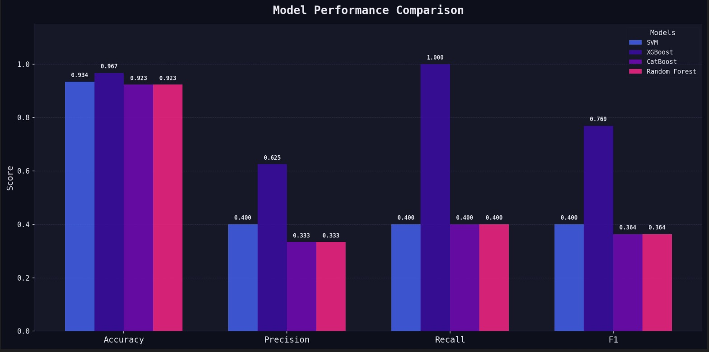
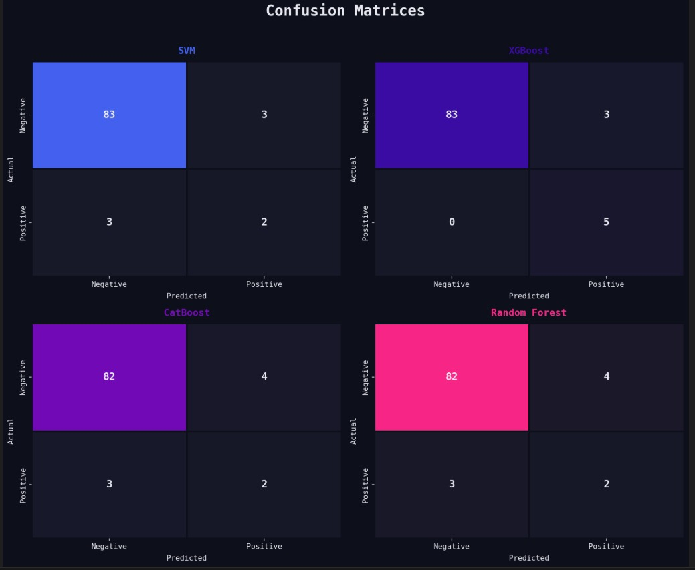

# 🎗️ Cervical Cancer Risk Classification

An end-to-end Machine Learning project for analyzing risk factors and predicting the likelihood of cervical cancer. The project covers exploratory data analysis (EDA), data preprocessing, model training, evaluation, and a deployable web application.

---

## 📂 Project Structure

```
Coding-week/
├── app/                  # Web application (app.py)
├── data/                 # Dataset (risk_factors_cervical_cancer.csv)
├── models/               # Serialized trained models (Random Forest, CatBoost, SVM, XGBoost)
├── notebook/             
│   └── eda.ipynb         # Jupyter notebooks for responding to the main 4 question of the data processing
├── src/
│   ├── data_processing.py   # Data cleaning and preparation
│   ├── train_model.py        # Model training scripts
│   └── evaluate_model.py     # Model evaluation scripts
├── tests/
│   └── test_models.py        # Unit tests for model reliability
├── Dockerfile            # Docker configuration for containerization
├── conftest.py           # Pytest configuration
├── requirements.txt      # Python dependencies
└── README.md
```

---

## 🚀 Getting Started

### Prerequisites

- Python 3.14
- (Optional) Docker

It is recommended to use a virtual environment.

### Installation

1. **Clone the repository:**


2. **Create and activate a virtual environment (optional but recommended):**

```bash
python -m venv .venv
.venv\Scripts\activate
```

3. **Install dependencies:**

```bash
pip install -r requirements.txt
```

---


## 📊 Dataset

The dataset used is `risk_factors_cervical_cancer.csv`, stored in the `data/` directory. It contains patient records with various risk factors associated with cervical cancer.

❓ Q1 — Was the dataset balanced? If not, how did you handle imbalance? What was the impact?

No, the dataset was severely imbalanced.

Class 0 (No risk): 803 patients — 93.6%

Class 1 (At risk): 55 patients — 6.4%

Imbalance ratio: 14.6 : 1

Strategy chosen: Manual oversampling on X_train only.
Random duplication of minority class samples (with replacement, np.random.seed(42)) until both classes reached a 1:1 ratio. Oversampling was applied exclusively on the training set — the test set was kept untouched to reflect real-world distribution and avoid data leakage.
Impact: The model is no longer biased toward always predicting "No risk." The primary evaluation metric shifted from accuracy to Recall (Sensitivity), since false negatives (missing a cancer case) are clinically far more dangerous than false positives.


---
## 🧠 Machine Learning Models

The project evaluates and compares several classification algorithms:

| Model | Description |
|---|---|
| **Random Forest** | Ensemble of decision trees, robust to overfitting |
| **SVM** | Support Vector Machine for binary classification |
| **CatBoost** | Gradient boosting optimized for categorical features |
| **XGBoost** | Extreme gradient boosting with high performance |

Trained models are saved in the `models/` directory for reuse.

❓ Q2 — Which ML model performed best? Provide performance metrics.

**XGBoost was the best overall model**, achieving the highest balance between precision and recall, making it the most clinically reliable choice.

| Model | Accuracy | Precision | Recall | F1 | ROC-AUC |
|---|---|---|---|---|---|
| SVM | 0.9341 | 0.4000 | 0.4000 | 0.4000 | 0.9488 |
| **XGBoost** | **0.9670** | **0.6250** | **1.0000** | **0.7692** | **0.9674** |
| CatBoost | 0.9231 | 0.3333 | 0.4000 | 0.3636 | 0.9581 |
| Random Forest | 0.9231 | 0.3333 | 0.4000 | 0.3636 | 0.9558 |

### 📊 Model Performance Comparaison




### 🔢 Confusion Matrices



**Why XGBoost?**
Given the medical context of this project, **Recall is the most critical metric** — missing a cancer case (false negative) is far more dangerous than a false alarm. XGBoost achieved a perfect recall of **100%**, meaning it correctly identified every at-risk patient in the test set. It also led in accuracy (96.7%), F1-score (76.9%), and ROC-AUC (0.9674), making it the dominant model across all metrics.

---
## 🎨SHAP

❓ Q3 — Which medical features most influenced predictions (SHAP results)?

The SHAP analysis on the CatBoost model identified the following **Top 10 Contributing Features**:

| Rank | Feature | Importance Score |
|---|---|---|
| 1 | **Schiller** | 36.1 |
| 2 | Age | 13.3 |
| 3 | First sexual intercourse | 13.1 |
| 4 | Hormonal Contraceptives (years) | 8.5 |
| 5 | Number of sexual partners | 6.7 |
| 6 | Num of pregnancies | 5.1 |
| 7 | Hinselmann | 3.3 |
| 8 | Dx:CIN | 2.4 |
| 9 | Smokes (packs/year) | 2.4 |
| 10 | Citology | 2.0 |

**Key insight:** The **Schiller test** (a clinical cervical examination) is by far the most dominant predictor with a score of 36.1 — nearly **3x more influential** than the next feature. This aligns with medical knowledge, as a positive Schiller test is a direct clinical indicator of abnormal cervical cells.

The next most influential features are **demographic and behavioral** (Age, First sexual intercourse, Hormonal Contraceptives, Number of sexual partners, Pregnancies), confirming that cervical cancer risk is shaped by a combination of clinical screening results and long-term lifestyle factors.

---

### Q4 — What insights did prompt engineering provide for your selected task?

Prompt engineering was used as a development assistant across **three key areas** of the project:

#### 🤖 Model Selection & Training
We used LLM assistance to guide the choice of algorithms suited for imbalanced medical classification, understand hyperparameter tuning strategies for CatBoost and XGBoost, and interpret model outputs. Prompting with specific context about our dataset (small size, severe imbalance, medical stakes) led to more targeted recommendations than generic documentation.

#### 🧹 Data Cleaning & Preprocessing
LLM assistance helped design the preprocessing pipeline — specifically around handling the `?` encoding of missing values, choosing median over mean imputation for robustness against outliers, and structuring the pipeline to avoid data leakage (fitting the imputer only on `X_train`). Providing the model with concrete constraints (858 rows, 55 positive cases, binary target) produced more relevant and context-aware suggestions.

#### 📊 SHAP & Streamlit Implementation
Prompt engineering significantly accelerated the implementation of SHAP visualizations and the Streamlit web application. By providing code snippets and error messages directly in prompts, we obtained targeted fixes and feature-specific guidance (e.g., rendering SHAP bar plots, structuring the app layout, connecting the trained model to the UI). Iterative prompting — refining requests based on previous outputs — proved more effective than single broad queries.

#### 💡 General Insight
The most effective prompts were **specific and context-rich**: including the dataset shape, class distribution, chosen models, and exact error messages yielded actionable answers. Vague prompts like *"how to fix imbalance"* were far less useful than *"I have 55 positive cases out of 858, which oversampling strategy avoids data leakage with a train/test split already done?"*

---

## 🧪 Running Tests

Unit tests are located in the `tests/` directory. Run them with:

```bash
pytest test/
```

---

## 🖥️ Web Application

The web application is located in the `app/` folder. To run it locally:

```bash
streamlit run app/app.py
```

Then open your browser and navigate to `http://localhost:5000` (or the port specified in the app).

---

## 📓 Exploratory Data Analysis

The `notebook/` folder contains Jupyter notebooks with full EDA:

```bash
jupyter notebook notebook/
```

---

## 👥 Contributors

- [@yahya-dev-e (yahya elomari)](https://github.com/yahya-dev-e)
- [@yassirjbili (yassir jbili)](https://github.com/yassirjbili)
- [@bakraouladomar (bakr aoulad omar)](https://github.com/bakraouladomar)
- [@elhaddadmohamed021-prog (mohamed elhaddad)](https://github.com/elhaddadmohamed021-prog)
- [@random255555 (ilyass elhadad)](https://github.com/random255555)

---

## 📄 License

This project is open source. Feel free to fork, use, and contribute!
